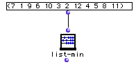

OpenMusic Reference  
---  
[Prev](list-max)| | [Next](list-modulo)  
  
* * *

# list-min

  
  
list-min  
  
(arithmetic module) \-- returns the smallest value in a tree  

## Syntax

`` **list-min**` self `

## Inputs

name| data type(s)| comments  
---|---|---  
` _self_`|  a tree|  
  
## Output

output| data type(s)| comments  
---|---|---  
first| a number| returns the smallest value in the list or tree  
  
## Description

This function returns the smallest value in the list.
[_Nesting_](glossary#NESTING) is ignored.

## Examples

### Taking the minimum value of a list

Processing this list will return 1.

* * *

[Prev](list-max)| [Home](index)| [Next](list-modulo)  
---|---|---  
list-max| [Up](funcref.main)| list-modulo

