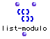
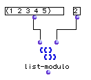

OpenMusic Reference  
---  
[Prev](list-min)| | [Next](mat-trans)  
  
* * *

# list-modulo

  
  
list-modulo  
  
(lists module) \-- Breaks a list down into sublists of elements at regular
intervals  

## Syntax

   **list-modulo**  list ncol  

## Inputs

name| data type(s)| comments  
---|---|---  
  _list_ |  a tree|  
  _ncol_ |  a non-negativeinteger| the modulo for the grouping  
  
## Output

output| data type(s)| comments  
---|---|---  
first| a tree|  
  
## Description

 list-modulo  breaks a list down into sublists of elements occuring every _n
th_ starting with the first, then starting with the second, etc., until all
the elements of the master list have been used. _n_ is specified by  _ncol_ 

It is possible that the lists will be of unequal length if  _ncol_  does not
divide evenly into  _list_ .

## Examples

### Using  list-modulo 

Starting with one, we get every 2nd element, so the first sublist is (1 3 5).
The next starts at two: (2 4). The function finishes here, since all the
elements have been used:

 ? OM->((1 3 5) (2 4)) 

* * *

[Prev](list-min)| [Home](index)| [Next](mat-trans)  
---|---|---  
list-min| [Up](funcref.main)| mat-trans

