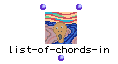

OpenMusic Reference  
---  
[Prev](list-modulo)| | [Next](list-of-members-of)  
  
* * *

# list-of-chords-in

  
  
list-of-chords-in  
  
(backtrack module) \-- Defines a list of `a-chord-in`s, i.e. a list of all-
different and sorted lists of Screamer variables  

## Syntax

`` **list-of-chords-in**` I dom &optional dom `

## Inputs

name| data type(s)| comments  
---|---|---  
` _I_`|  a non-negative integer| the lengths of the lists within the master
list  
` _dom_`|  a tree| the domain for each variable  
` _prov_`|  a lambda function or list thereof| optional; specifies a
constraint to be applied to the each 'intermediate' list, i.e. each sublist.
The constraints must be predicates which accept the same data type as the
variables.  
  
## Output

output| data type(s)| comments  
---|---|---  
first| a tree|  a list of lists of `_I_` elements, each sorted and all-
different variables  
  
## Description

Functions with the added constraints of [`a-chord-in`](a-chord-in). An
optional predicate can be specified which will be applied to each element of
the master list (i.e. the first branching of the tree.) For example, if the
function is used to generate a **Chordseq** , then the predicate(s) will
operate on the **Chord** s. The actual values returned will depend on the
backtracking caused by the constraints.

* * *

[Prev](list-modulo)| [Home](index)| [Next](list-of-members-of)  
---|---|---  
list-modulo| [Up](funcref.main)| list-of-members-of

