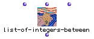

OpenMusic Reference  
---  
[Prev](list-of-members-of)| | [Next](mat-trans)  
  
* * *

# list-of-integers-between

  
  
list-of-integers-between  
  
(backtrack module) \-- defines a list of Screamer variables within the
specified interval  

## Syntax

   **list-of-integers-between**  n low high  

## Inputs

name| data type(s)| comments  
---|---|---  
  _n_ |  an integer| the length of the list to create  
  _low_ |  an integer| the minimum of possible values for each variable  
  _high_ |  an integer| the maximum of possible values for each variable  
  
## Output

output| data type(s)| comments  
---|---|---  
first| a list| a list of integers between  _low_  and  _high_   
  
## Description

Defines a list of Screamer variables in the interval [  _low_   _high_  ] The
actual output will depend on the backtracking caused by the constraints.

* * *

[Prev](list-of-members-of)| [Home](index)| [Next](mat-trans)  
---|---|---  
list-of-members-of| [Up](funcref.main)| mat-trans

