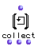
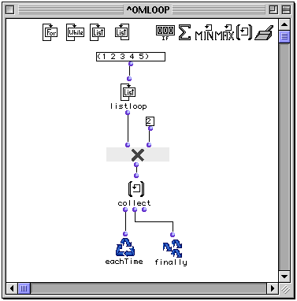
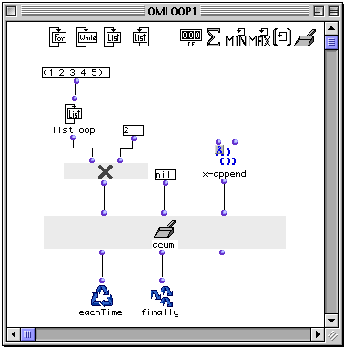

OpenMusic Reference  
---  
[Prev](maxi)| | [Next](accumulator)  
  
* * *

# listing

  
  
listing  
  
(control module) \-- returns the results of `omloop` in a list  

## Syntax

`` **listing**` what? &optional retard `

|

Though it is called `listing` in its LISP code, this function appears as
`collect` when used inside `omloop`. The reason eludes me.  
  
---|---  
  
## Inputs

name| data type(s)| comments  
---|---|---  
` _what?_`|  any|  
` _retard_`|  a function name or lambda function|  
  
## Output

output| data type(s)| comments  
---|---|---  
first| a list with one element| triggers the collection  
second| a list or tree| returns the state of the collection without evaluation  
third| 0| reinitializes the counter, resetting it to nil  
  
## Description

|

`listing` is part of a group of functions for performing iterative
[loops](glossary#LOOP). They can only be used within an
[omloop](omloop) patch window. Since they only function within the
context of the entire repeating loop, they (or any function connected to them)
cannot be evaluated directly within the patch window. You must evaluate the
entire loop. See the entry on `omloop` for more information.  
  
---|---  
  
`listing` is a type of collector. It returns all the results of the loop in a
single list. If the results of the loop function are themselves lists, the
result will be a tree.

Like all collectors, `listing` has three outputs:

The first output triggers the collector, evaluating whatever is connected to
it and appending the result to the list of values of previous repetitions of
the loop. It is usually connected to `eachTime`. The value carried by the
connection itself is the current result of the evaluation of the loop,
enclosed in parentheses, a list of one element. You can verify this by placing
the lisp function `print` between the first output and `eachTime`.

The second output returns the current state of the collector, without
evaluating whatever is connected to it. It is usually connected to `finally`
so that you can get the results of the addition.

The third output reinitializes the collector, resetting it to nil. The value
carried by the connection is always nil.

## Examples

|  **About the collectors**  
---|---  
 |

`listing` is a type of collector. The most generalized type of collector is
the function `accumulator`. Some collectors are special versions of the
`accumulator` function. In these cases, the example of the use of the specific
collector is reproduced with accumulator to illustrate this. The reader is
therefore advised to read the entry on [`accumulator`](accumulator)
before continuing.  
  
### Gathering the results of `omloop` using `listing`

This simple example takes each of the elements (1 2 3 4 5) and passes them
individually to `om*`, where they are multiplied by 2 and passed to `listing`,
which simply collects them into a list. The output is:

`? OM->(2 4 6 8 10)`

### Reproducing `listing` with `accumulator`

We will set up `accumulator` to perform exactly the same function. The
`listloop` output of (1 2 3 4 5) is run into the first input. We set the
initial value to nil and connect the function `x-append` to the `_fun_` input.
At each iteration, the list of stored values of the evaluations coming into
the first input of `accumulator` and the current evaluation of the loop are
passed to `x-append`. The resulting list is stored, for the next pass.

For a more musical example of the use of `listing`, see the entry for
[`listloop`](listloop).

* * *

[Prev](maxi)| [Home](index)| [Next](accumulator)  
---|---|---  
maxi (max)| [Up](funcref.omloop)| accumulator

