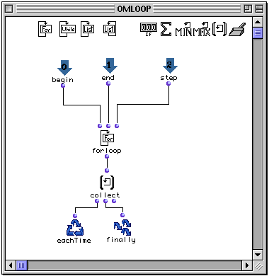
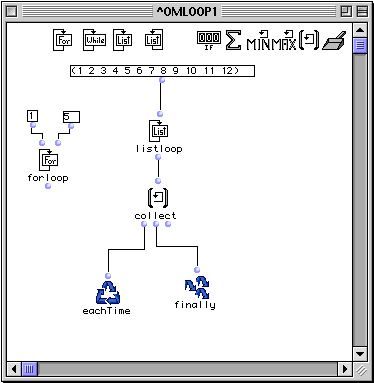

OpenMusic Reference  
---  
[Prev](whileloop)| | [Next](onlistloop)  
  
* * *

# listloop

  
  
listloop  
  
(control module) \-- Enumerates the elements of a list within  omloop   

## Syntax

   **listloop**  list &optional by  

## Inputs

name| data type(s)| comments  
---|---|---  
  _list_ |  a list or tree|  
  _by_ |  a function name or lambda function|  
  
## Output

output| data type(s)| comments  
---|---|---  
first| any| the elements of  _list_  , individually and sequentially  
  
## Description

|

 listloop  is part of a group of functions for performing iterative
[loops](glossary#LOOP). They can only be used within an
[omloop](omloop) patch window. Since they only function within the
context of the entire repeating loop, they (or any function connected to them)
cannot be evaluated directly within the patch window. You must evaluate the
entire loop. See the entry on  omloop  for more information.  
  
---|---  
  
 listloop  is one of the most useful  omloop  iterators. At each repetition,
it returns an element of the list, stepping through them individually, in
order. If no other iterators are used, loop execution terminates when the list
has been exhausted. In this way, a single function or functions can be made to
act on all the elements of a list of data.

## Examples

### Simple  listloop  examples

Here we will use  listloop  to add a level of parentheses to each element of a
list:

 listloop  gives each element of (1 2 3 4 5) to the LISP function  list ,
which makes a one-element list out of it, and the resulting sublists are
collected by  collect :

 ? OM->((1) (2) (3) (4) (5)) 

The list (1 2 3 4 5) could have been connected from outside the  omloop 
module by adding an input:

### Using  omloop  to extract midics from a **Voice**

Let's assume we wanted to perform some kind of operation on the pitch values
in a **Voice** , a transposition, for example. The pitch information, in
midics, is not available at any **Voice** output. The **Voice** contains a
list of **Chord** objects, however, which each have a midic output. We take
the following material in a **Voice** and plug the third output into a loop
with the following internal structure:

The third output of the voice will return a list of **Chord** objects. This
will enter the  omloop  module where each individual element of that list,
i.e. each chord, will be plugged into a **Chord** factory, of which we can
then take the second output, which will be a list of the midics comprising
each chord. These will be collected by the  collect  box, and the result, a
list of lists of midics representing each note and chord in the original
voice, is returned:

 ? OM->((5800 5100) (7500) (5300) (7100) (6000 6800 6900) (5600) (5100)
(3700)) 

After that, transposing is as simple as using an arithmetic function to add or
subtract a value from the list's elements.

* * *

[Prev](whileloop)| [Home](index)| [Next](onlistloop)  
---|---|---  
whileloop| [Up](funcref.omloop)| onlistloop

