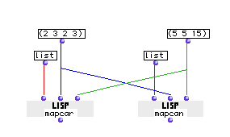
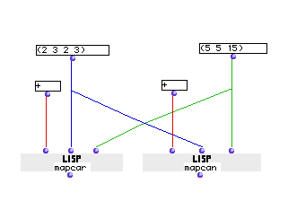

OpenMusic Reference  
---  
[Prev](mat-trans)| | [Next](mapcar)  
  
* * *

# mapcan

  
  
mapcan  
  
(LISP function) \-- returns the results of several evaluations of  _function_ 
as a single entity  

## Syntax

   **mapcan**  function list &restmore-lists  

## Inputs

name| data type(s)| comments  
---|---|---  
  _function_ |  symbol, function name or lambda function | the function that will be evaulated  
  _list_ |  a list or tree| A list of arguments for the first input of _function_   
 _more-lists_ |  a list or tree| repeatable; lists of arguments for additional inputs of  _function_   
  
## Output

output| data type(s)| comments  
---|---|---  
first| any| the results of the evaluations  
  
## Description

Calls  _function_  , passing it the first argument of  _list_  and  _more-
lists_  , then calling it again, but passing the second element of  _list_ 
and  _more-lists_  , and so on, until the lists (or the shortest of the input
lists, if they are not the same length) has been exhausted. The results of the
series of function calls are combined with the function  nconc  and returned
as a list.

  _function_  may be a symbol, a function name, or function in lambda mode.
Note that if you pass a function in lambda mode with repeatable inputs, you
must add the correct number to accomodate the number of arguments you are
passing it at the other inputs. This is not necessary if the function name is
entered directly instead of its icon in lambda mode.

 mapcan  is similar in operation to [ funcall ](funcall), which also
calls  _function_  but only calls it once, passing _all_ its arguments
simultaneously.  mapcan  is also similar to [ mapcar ](mapcar), which
iterates lists as arguments to  _function_  in the same way but returns the
results as separate sublists. See examples.

***

  
 
| **LISP functions**|
|--|
| The basic LISP functions are too numerous to document comprehensively in this manual. As an aid to the neophyte, the most commonly used have been included in this documentation, but they represent a small fraction of the total functionality of the [_MCL_](glossary#MCL) environment. Numerous on-line resources exist, for instance the [online version of _Common Lisp the Language, 2nd Edition_.](https://www.cs.cmu.edu/Groups/AI/html/cltl/clm/clm.html)|

***

## Examples

### Comparing  mapcan  and  mapcar 

This illustrates the difference between  mapcan  and  mapcar . They will both
get the same inputs, the function  list  and the lists (2 3 2 3) and (5 5 15).
Both will pass the first elements of the two lists to  list , then the second,
then the third. Notice that the first list has four elements. This fourth
element is not used by either, since the smaller of the two lists only has
three elements and the rule of the shortest list is observed.

 mapcar  returns the results of each  list  operation as sublists within a
larger list:

 ? OM->((2 5) (3 5) (2 15)) 

while  mapcan , performs  nconc  on its results.  nconc  is a LISP function
which appends lists. So the subgroups are removed from the  mapcan  output:

 ? OM->(2 5 3 5 2 15) 

Because  nconc  is a destructive function (meaning it alters the original, not
making a copy) designed to append lists, if you use functions with  mapcan 
that do not return lists as their output, the first elements of the results
will actually be suppressed and only the final result will be returned. Try
replacing the  list  function with the LISP function  + :

Running  mapcar  now produces a list of the sums of the pairs of first,
second, and third elements. These sums are **not** themselves lists:

 ? OM->(7 8 17) 

Because of this, while  mapcan , performs the  nconc  on the results, all but
the last result are supressed. It returns:

 ? OM->17 

* * *

[Prev](mat-trans)| [Home](index)| [Next](mapcar)  
---|---|---  
mat-trans| [Up](funcref.main)| mapcar

