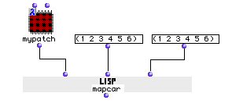
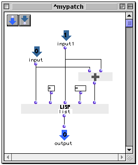

OpenMusic Reference  
---  
[Prev](mapcan)| | [Next](maquette2obj)  
  
* * *

# mapcar

  
  
mapcar  
  
(LISP function) \-- returns the results of several evaluations of  _function_ 
as a list  

## Syntax

   **mapcar**  function list &restmore-lists  

## Inputs

name| data type(s)| comments  
---|---|---  
  _function_ |  symbol, function name or lambda function | the function that
will be evaulated  
  _list_ |  a list or tree| A list of arguments for the first input of
 _function_   
 _more-lists_ |  a list or tree| repeatable; lists of arguments for additional
inputs of  _function_   
  
## Output

output| data type(s)| comments  
---|---|---  
first| a list or tree| the results of the evaluations  
  
## Description

Calls  _function_  , passing it the first argument of  _list_  and  _more-
lists_  , then calling it again, but passing the second element of  _list_ 
and  _more-lists_  , and so on, until the lists (or the shortest of the input
lists, if they are not the same length) has been exhausted. The results of the
series of function calls are collected in a list and returned.

  _function_  may be a symbol, a function name, or function in lambda mode.
Note that if you pass a function in lambda mode with repeatable inputs, you
must add the correct number to accomodate the number of arguments you are
passing it at the other inputs. This is not necessary if the function name is
entered directly instead of its icon in lambda mode.

 mapcar  is similar in operation to [_ funcall _](funcall), which also
calls  _function_  but only calls it once, passing _all_ its arguments
simultaneously.  mapcar  is also similar to [ mapcan ](mapcan), which
iterates lists as arguments to  _function_  in the same way but returns the
result as a single entity..

|  **LISP functions**  
---|---  
 |

The basic LISP functions are too numerous to document comprehensively in this
manual. As an aid to the neophyte, the most commonly used have been included
in this documentation, but they represent a small fraction of the total
functionality of the [_MCL_](glossary#MCL) environment. Numerous on-line
resources exist, for instance the [online version of _Common Lisp the
Language, 2nd Edition_.](http://www-2.cs.cmu.edu/afs/cs.cmu.edu/project/ai-
repository/ai/cltl/clm/)  
  
## Examples

### An "edcuational" example of  mapcar 

Here, the first elements in the two lists will be passed to patch  mypatch 's
two inputs, followed by the second elements of the two lists, and so on.
Here's what's happening in  mypatch :

The pairs are being made into lists together with the symbols + and = and
their sums. The resulting lists will be collected for each pair of inputs:

 ? OM->((1 + 1 = 2) (2 + 2 = 4) (3 + 3 = 6) (4 + 4 = 8) (5 + 5 = 10) (6 + 6 =
12)) 

* * *

[Prev](mapcan)| [Home](index)| [Next](maquette2obj)  
---|---|---  
mapcan| [Up](funcref.main)| maquette2obj

