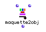

OpenMusic Reference  
---  
[Prev](mapcar)| | [Next](mask)  
  
* * *

# maquette2obj

  
  
maquette2obj  
  
(score module) \-- Makes a transcription of a
[**Maquette**](glossary#MAQUETTE) object suitable for use in a
[**Poly**](poly) or [**Multi-seq**](multi-seq).  

## Syntax

 **maquette2obj**   maquette mode &optional tempi measures max/ forbid offset precis  

## Inputs

|

The optional inputs of this function duplicate the inputs of
[ omquantify ](omquantify). See its entry for information on these
inputs.  
  
---|---  
  
name| data type(s)| comments  
---|---|---  
  _maquette_ |  A [**Maquette**](glossary#MAQUETTE) object|  
  _mode_ |  menu| Two options; Poly and Multi-seq  
  
## Output

output| data type(s)| comments  
---|---|---  
first| A [**Poly**](poly) or [**Multi-seq**](multi-seq)|  
  
## Description

This function transcribes the output of any
[**Maquette**](glossary#MAQUETTE) object. The output is either a
[**Multi-seq**](multi-seq) or a  _Poly_  , as selected at the second
input. Each of the embedded objects is transcribed in a separate layer of the
[**Poly**](poly) or [**Multi-seq**](multi-seq). (An embedded
[**Maquette**](glossary#MAQUETTE) will be itself transcribed into a
single layer).

If you choose to make a  _Poly_  , [ omquantify ](omquantify) is called
to transcribe the rhythmic values, and the optional inputs control the
transcription in the same way as they do for that function. See its reference
page for details.

* * *

[Prev](mapcar)| [Home](index)| [Next](mask)  
---|---|---  
mapcar| [Up](funcref.main)| mask

