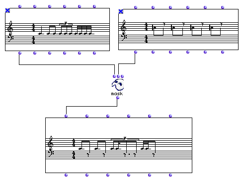

OpenMusic Reference  
---  
[Prev](maquette2obj)| | [Next](mc-f)  
  
* * *

# mask

  
  
mask  
  
(score module) \-- Uses one **Voice** as a rhythmic mask for another  

## Syntax

   **mask**  obj1 obj2 &optional mode  

## Inputs

name| data type(s)| comments  
---|---|---  
  _obj1_ |  a **Voice** object|  
  _obj2_ |  a **Voice** object|  
  _mode_ |  -1 or 1| defaults to 1  
  
## Output

output| data type(s)| comments  
---|---|---  
first| a **Voice** object|  
  
## Description

 mask  uses  _obj2_  as a rhythmic mask for  _obj1_ .  _obj1_  is suppressed
where  _obj2_  has rests; it plays when  _obj2_  is playing. The pitch content
is thus exclusively from  _obj1_  , while the rhythmic content can be from
 _obj2_  or both, depending on the rhythms concerned. See below.

The optional  _mode_  input takes either -1 or 1. 1 is the normal setting;
using -1 will invert the mask, causing  _obj1_  to play only when  _obj2_  is
not playing.

## Examples

### How  mask  works

Here we take the **Voice** on the left and mask it with the rhythm of the
**Voice** on the right. Note that all the pitches are from the left-hand
**Voice**.

On the first beat of the measure, the C is abbreviated to the eighth note of
the masking **Voice**. On beat two, the first C is untouched since it
corresponds exactly to a note in the masking **Voice**.

On beat three, The first triplet eighth note is untouched since its entire
duration falls within a sounding note in the masking **Voice**. The second
eighth note triplet is cut in half since the masking eighth note ends halfway
through its duration. The last of the triplet is entirely suppressed since
there is no note sounding in the masking **Voice**.

On beat four, the first two sixteenths are kept since there is an eighth
sounding in the masking **Voice**. The last two are suppressed since the
masking **Voice** has a rest.

* * *

[Prev](maquette2obj)| [Home](index)| [Next](mc-f)  
---|---|---  
maquette2obj| [Up](funcref.main)| mc->f

