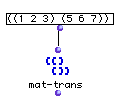

OpenMusic Reference  
---  
[Prev](list-modulo)| | [Next](mapcan)  
  
* * *

# mat-trans

  
  
mat-trans  
  
(lists module) \-- returns a matrix with the rows and columns exchanged  

## Syntax

   **mat-trans**  matrix  

## Inputs

name| data type(s)| comments  
---|---|---  
  _matrix_ |  a tree| with at least one level of [nesting](glossary#NESTING)  
  
## Output

output| data type(s)| comments  
---|---|---  
first| a tree|  
  
## Description

 mat-trans  transposes a matrix. A matrix is a data structure where data is
arranged in multiple dimensions. The simplest kind of matrix is a grid, which
can be read as a series of x and y values. A matrix in LISP is a tree with
sublists. The tree ((1 2 3) (5 6 7)) is a matrix with two dimensions, i.e. two
sublists.  mat-trans  functions as if the sublists of  _matrix_  were arranged
vertically, and reads the columns into new lists, which are returned.
 _matrix_  must therefore be a list of lists.

## Examples

### Transposing a matrix

The two sublists can be thought of as forming the rows of a matrix:

  
(1 2 3)  
(5 6 7)  

of which the columns are read, left to right, into new lists, returning:

 ? OM->((1 5) (2 6) (3 7)) 

If  _matrix_  were given as ((1 2) (3 4) (5 6) (7 8) (9 10)) then  mat-trans 
returns:

 ? OM->((1 3 5 7 9) (2 4 6 8 10)) 

* * *

[Prev](list-modulo)| [Home](index)| [Next](mapcan)  
---|---|---  
list-modulo| [Up](funcref.main)| mapcan

