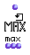
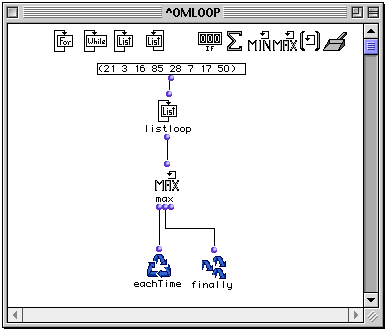
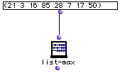

OpenMusic Reference  
---  
[Prev](minim)| | [Next](listing)  
  
* * *

# maxi (max)

  
  
maxi (max)  
  
(control module) \-- returns the maximum value present among its collected
elements  

## Syntax

   **maxi**  what? &optional retard  

|

Though it is called  maxi  in its LISP code, this function appears as  max 
when used inside  omloop . The reason eludes me.  
  
---|---  
  
## Inputs

name| data type(s)| comments  
---|---|---  
  _what?_ |  a number|  
  _retard_ |  a function name or lambda function|  
  
## Output

output| data type(s)| comments  
---|---|---  
first| a number| triggers the collection  
second| a number| returns the state of the collection without evaluation  
third| -4294967296| reinitializes the counter, resetting it to -4294967296  
  
## Description

|

 maxi  is part of a group of functions for performing iterative
[loops](glossary#LOOP). They can only be used within an
[omloop](omloop) patch window. Since they only function within the
context of the entire repeating loop, they (or any function connected to them)
cannot be evaluated directly within the patch window. You must evaluate the
entire loop. See the entry on  omloop  for more information.  
  
---|---  
  
 maxi  is a type of collector. It returns the highest value of all the results
of the loop.

Like all collectors,  maxi  has three outputs:

The first output triggers the collector, evaluating whatever is connected to
it. The resulting number is then compared with the stored result of previous
evaluations. If it is higher, it replaces the stored result, otherwise, the
stored result is kept. It is usually connected to  eachTime . The value
carried by the connection itself is the highest value thus far encountered
among the repeated evaluations, which you can verify by placing the lisp
function  print  between the first output and  eachTime .

The second output returns the current state of the collector, without
evaluating whatever is connected to it. It is usually connected to  finally 
so that you can get the results of the comparison.

The third output reinitializes the collector, resetting it to -4294967296. The
value carried by the connection is always -429496729. (For those curious, this
crazy number is the lowest value that a 32-bit integer can represent (the sign
is not carried among the bits representing the numeric value of the number))

## Examples

### Using  maxi 

This simple example passes uses  listloop  to pass each of the list values
individually to  maxi . The highest value is retained:

 ? OM->85 

A simpler solution would have been to plug that list directly into the [ list-
max ](list-max) function:

* * *

[Prev](minim)| [Home](index)| [Next](listing)  
---|---|---  
minim (min)| [Up](funcref.omloop)| listing

