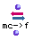

OpenMusic Reference  
---  
[Prev](mask)| | [Next](merger)  
  
* * *

# mc->f

  
  
mc->f  
  
(conversions module) \-- converts midicent pitches to frequencies in Hertz
(Hz)  

## Syntax

   **mc- >f**  midics  

## Inputs

name| data type(s)| comments  
---|---|---  
  _midics_ |  an integer or list thereof| a midicent or a list of midicents  
  
## Output

output| data type(s)| comments  
---|---|---  
first| a number or list thereof, usually floats|  
  
## Description

This function accepts either a [_midic_](glossary#MIDIC) value or a list
of midic values at its first input. They will converted into audio
frequencies, in Hz.

* * *

[Prev](mask)| [Home](index)| [Next](merger)  
---|---|---  
mask| [Up](funcref.main)| merger

