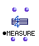

OpenMusic Reference  
---  
[Prev](maquetteclass)| | [Next](midifile)  
  
* * *

# Measure

  
  
Measure  
  
(score module) \--  

## Syntax

   **Measure** ` self tree  `

## Slots

name| data type(s)| comments  
---|---|---  
  _self_ | [ **Measure**](measure) object, [**Group**](groupclass) object, list of [**Group**](glossary#GROUP) objects|  
  _tree_ |  a rhythm tree|  
  
## Notes

See [the chapter on Rhythm Trees](concepts.rhythm-trees) for more
information on this special data-type.

* * *

[Prev](maquetteclass)| [Home](index)| [Next](midifile)  
---|---|---  
Maquette| [Up](classref.main)| Midifile

