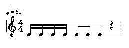

OpenMusic Reference  
---  
[Prev](mc-f)| | [Next](mf-info)  
  
* * *

# merger

  
  
merger  
  
(score module) \-- Superimposes one **Voice** or **Measure** object on another  

## Syntax

   **merger**  chs1 chs2  

## Inputs

name| data type(s)| comments  
---|---|---  
  _chs1_ |  a **Voice** or **Measure** object|  
  _chs2_ |  same as  _chs1_ |  
  
## Output

output| data type(s)| comments  
---|---|---  
first| a **Voice** or **Measure** object|  
  
## Description

The  merger  takes two **Voice** s or **Measure** s and returns a single
object of the same type containing them both. It is as if they were played
simultaneously and the result transcribed into a single object.

## Examples

### Merging two rhythms

Here we use two **Measure** objects to merge two rhythmic patterns into a
single element which contains them both. The first **Measure** is initialized
with the rhythm tree:

    
    
    (4//4 ((1 (1 1 1)) (1 (1 1 1)) (1 (1 1 1)) -1))  
  
---  
  
Representing a measure with the following structure:

The second **Measure** is given the rhythm tree

    
    
    (4//4 ((1 (1 1 1 1)) (1 (1 1)) 1 -1))  
  
---  
  
Representing a measure with the following structure:

The two are passed to  merger , the output connected to a **Voice** object (of
which the first input can accept a **Measure** ). The resulting rhythm,
displayed below, is

    
    
    (1 (((4 4) ((1 ((1 (3 1)) (1 (1 1)) (1 (1 3)))) (1 (1 (1 (1 1)) 1)) (1 (1 1 1)) -1))))  
  
---  
  

* * *

[Prev](mc-f)| [Home](index)| [Next](mf-info)  
---|---|---  
mc->f| [Up](funcref.main)| mf-info

