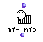
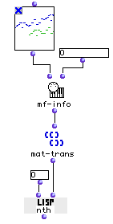

OpenMusic Reference  
---  
[Prev](merger)| | [Next](midi-o)  
  
* * *

# mf-info

  
  
mf-info  
  
(midi module) \-- creates a tree describing a MIDI file  

## Syntax

   **mf-info**  self &optional tracknum  

## Inputs

name| data type(s)| comments  
---|---|---  
  _self_ |  an OM **Midifile** object|  
  _tracknum_ |  an integer| optional; must be between 0 and 15, inclusive. Causes  mf-info  to analyze only one track within the file.  
  
## Output

output| data type(s)| comments  
---|---|---  
first| a tree|  
  
## Description

 mf-info  returns a tree describing a MIDI file. Unless you use the optional
input  _tracknum_  to isolate a single track, the highest level of the tree is
a list of tracks. Each track is a list of notes. Each of the notes is a list
of parameters in the form:

( _note, onset, duration, velocity, channel_ )

 _note_ is the MIDI note number, where middle C is 60. Note that this value is
**not** in midicents.

 _onset_ is the time the note begins, measured from the beginning of the file
in milliseconds.

 _duration_ is the duration of the note, measured in milliseconds.

 _velocity_ is the velocity of the note, a value between 0 and 127.

 _channel_ is the MIDI channel the note is played on, from 1 to 16.

|  **OM and MIDI**  
---|---  
 |

OM can be configured to communicate with any [_MIDI_](glossary#MIDI)
device. See the chapter on [configuring Midishare](getting-started.install-
midishare) for more information.  
  
## Examples

### Extracting note numbers from a **Midifile**

Here we'll use  mf-info  to isolate the MIDI note numbers of a **Midifile**.
 mf-info  is set to return a description of the first track only (0 at second
input). This list of lists is passed to  mat-trans , which returns a tree in
which the first element is a list of all the first elements of the sublists of
the input (see the entry on [ mat-trans ](mat-trans) for more
information). Since the first parameter of the note lists is the MIDI note
value, the first list in the output of  mat-trans  will be a list of all the
MIDI note values. We take this first element with the  nth  function. Changing
the first input of  nth  from 0 to 2, for example would return a list of all
the note durations in the sequence.

* * *

[Prev](merger)| [Home](index)| [Next](midi-o)  
---|---|---  
merger| [Up](funcref.main)| midi-o

