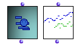

OpenMusic Reference  
---  
[Prev](measure)| | [Next](multi-seq)  
  
* * *

# Midifile

  
  
Midifile  
  
(score module) \--  

## Syntax

 **Midifile**   self  

## Slots

name| data type(s)| comments  
---|---|---  
 _self_ | [ **Midifile**](midifile) object|  
  
## Notes

[ **Midifile**](midifile) factories are generally obtained by dragging a
[**Midifile**](midifile) from the finder to a patch window. After doing
that, lock the icon immediately or you will lose its contents when you try to
evaluate it.

To convert a [**Midifile**](midifile) to symbolic data, connect it to the
function [ mf-info ](mf-info).

An unlocked [**Midifile**](midifile) object when evaluated will bring up
a dialog box asking you to find a MIDI file.

* * *

[Prev](measure)| [Home](index)| [Next](multi-seq)  
---|---|---  
Measure| [Up](classref.main)| Multi-seq

