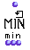
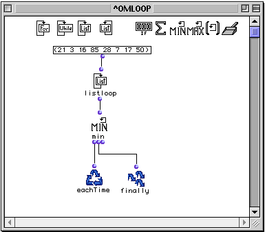
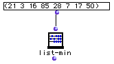

OpenMusic Reference  
---  
[Prev](sum)| | [Next](maxi)  
  
* * *

# minim (min)

  
  
minim (min)  
  
(control module) \-- returns the minimum value present among its collected
elements  

## Syntax

`` **minim**` what? &optional retard `

|

Though it is called `minim` in its LISP code, this function appears as `min`
when used inside `omloop`. The reason eludes me.  
  
---|---  
  
## Inputs

name| data type(s)| comments  
---|---|---  
` _what?_`|  a number|  
` _retard_`|  a function name or lambda function|  
  
## Output

output| data type(s)| comments  
---|---|---  
first| a number| triggers the collection  
second| a number| returns the state of the collection without evaluation  
third| 4294967296| reinitializes the counter, resetting it to 4294967296  
  
## Description

|

`minim` is part of a group of functions for performing iterative
[loops](glossary#LOOP). They can only be used within an
[omloop](omloop) patch window. Since they only function within the
context of the entire repeating loop, they (or any function connected to them)
cannot be evaluated directly within the patch window. You must evaluate the
entire loop. See the entry on `omloop` for more information.  
  
---|---  
  
`minim` is a type of collector. It returns the lowest value of all the results
of the loop.

Like all collectors, `minim` has three outputs:

The first output triggers the collector, evaluating whatever is connected to
it. The resulting number is then compared with the stored result of previous
evaluations. If it is lower, it replaces the stored result, otherwise, the
stored result is kept. It is usually connected to `eachTime`. The value
carried by the connection itself is the lowest value thus far encountered
among the repeated evaluations, which you can verify by placing the lisp
function `print` between the first output and `eachTime`.

The second output returns the current state of the collector, without
evaluating whatever is connected to it. It is usually connected to `finally`
so that you can get the results of the comparison.

The third output reinitializes the collector, resetting it to 4294967296. The
value carried by the connection is always 429496729. (For those curious, this
crazy number is the highest value that a 32-bit integer can represent.)

## Examples

### Using `minim`

This simple example passes uses `listloop` to pass each of the list values
individually to `minim`. The lowest value is retained:

`? OM->3`

A simpler solution would have been to plug that list directly into the [`list-
min`](list-min) function:

* * *

[Prev](sum)| [Home](index)| [Next](maxi)  
---|---|---  
sum| [Up](funcref.omloop)| maxi (max)

