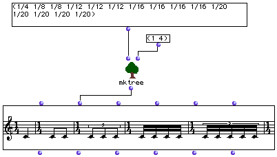

OpenMusic Reference  
---  
[Prev](midi-o)| | [Next](nth)  
  
* * *

# mktree

  
  
mktree  
  
(score module) \-- Constructs a rhythm tree from a list of **rational** s
(fractions)  

## Syntax

   **mktree**  rhythm timesigns  

## Inputs

name| data type(s)| comments  
---|---|---  
  _rhythm_ |  a list of rationals (fractions)|  
  _timesigns_ |  A list of integers or list of lists integers. See below|  
  
## Output

output| data type(s)| comments  
---|---|---  
first| a rhythm tree|  
  
## Description

The  mktree  takes a list of fractions representing note values and converts
them into a rhythm tree suitable for use in a **Voice** object. 1/4 represents
the quarter note, 1/8 the eighth note, etc. Note that tuplets of all kinds are
also permitted: 1/6 for quarter note triplet etc. Negative values will be
transcribed as rests. Values which cross barlines or rhythmic groupings will
be transcribed as the appropriate tied notes.

The  _timesigns_  input takes either a single time signature in the form (a b)
or a list thereof, i.e. ((4 4) (3 4)). If a single time signature is specified
it will be repeated as needed.

|

This function was programmed by Orjan Sandred.  
  
---|---  
  
## Examples

### Making a rhythm tree with  mktree 

Note that way that tuplets are represented in the third and fifth measures.
The timesign (1 4) is repeated to the necessary length. The rhythm tree
produced is:

 ? OM->(? (((1 4) (1)) ((1 4) ((1 (1 1)))) ((1 4) ((1 (1 1 1)))) ((1 4) ((1 (1
1 1 1)))) ((1 4) ((1 (1 1 1 1 1)))) ((1 4) (-1)))) 

* * *

[Prev](midi-o)| [Home](index)| [Next](nth)  
---|---|---  
midi-o| [Up](funcref.main)| nth

