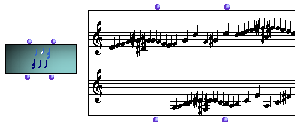

OpenMusic Reference  
---  
[Prev](midifile)| | [Next](n-cercle)  
  
* * *

# Multi-seq

  
  
Multi-seq  
  
(score module) \--  

## Syntax

 **Multi-seq** ` self chord-seqs `

## Slots

name| data type(s)| comments  
---|---|---  
 _self_ | [ **Multi-seq**](multi-seq) object or [**Midifile**](midifile) object.|  
  _chord-seqs_ |  list of [**Chord-seq**](chord-seq) objects|  
  
## Notes

[ **Multi-seq**](multi-seq) has a graphic editor described in detail in
the [Editors Reference](editors.notation)

* * *

[Prev](midifile)| [Home](index)| [Next](n-cercle)  
---|---|---  
Midifile| [Up](classref.main)| N-cercle

