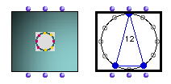

OpenMusic Reference  
---  
[Prev](multi-seq)| | [Next](note)  
  
* * *

# N-cercle

  
  
N-cercle  
  
(Zn module) \--  

## Syntax

 **N-cercle**   self n puntos  

## Slots

name| data type(s)| comments  
---|---|---  
 _self_|  an [**N-cercle**](n-cercle) object|  
 _n_|  a positive integer| floats are permitted as well, but will not display correctly.  
  _puntos_ |  a list or tree of integers|  
  
## Notes

N-cercle accepts the group of points _puntos_ and displays them as a polygon
on a circle having _n_ articulations on its circumference. _n_ must be at
least 1 but has no upper limit. If _puntos_ is a flat list, all the data
points will be represented as part of the same polygon. If it is a tree, each
sublist is used to compose a separate polygon, which appears as a layer in a
stack in the graphic editor.

For more information on using the [**N-cercle**](n-cercle) object, see
the Zn tutorials.

* * *

[Prev](multi-seq)| [Home](index)| [Next](note)  
---|---|---  
Multi-seq| [Up](classref.main)| Note

