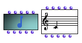

OpenMusic Reference  
---  
[Prev](n-cercle)| | [Next](poly)  
  
* * *

# Note

  
  
Note  
  
(score module) \--  

## Syntax

`` **Note**` sefl midic vel dur chan `

## Slots

name| data type(s)| comments  
---|---|---  
` _self_`| [ **Note**](note) object|  
` _midic_`|  A midicent (MIDI number*100)|  
` _vel_`|  an integer between 0 and 127|  
` _dur_`|  a number representing the duration in milliseconds|  
` _chan_`|  an integer between 1 and 16|  
  
## Notes

[ **Note**](note) has a graphic editor described in detail in the
[Editors Reference](editors.notation)

* * *

[Prev](n-cercle)| [Home](index)| [Next](poly)  
---|---|---  
N-cercle| [Up](classref.main)| Poly

