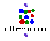

OpenMusic Reference  
---  
[Prev](nthcdr)| | [Next](numerator)  
  
* * *

# nth-random

  
  
nth-random  
  
(combinatorial module) \-- returns a randomly chosen element of a list  

## Syntax

`` **nth-random**` list `

## Inputs

name| data type(s)| comments  
---|---|---  
` _list_`|  a list or tree|  
  
## Output

output| data type(s)| comments  
---|---|---  
first| any type| a randomly chosen element of the list  
  
## Description

Returns a randomly chosen element of the list, which may be different each
time the function is run. `nth-random` respects
[nesting](glossary#NESTING), i.e. if the list is a tree, the randomly
chosen element may be an entire sublist of the tree. For example, if the list
(1 (2 3) 4) is given, either 1 or (2 3) or 4 may result, but **never** 2 or 3
alone, since they occur within an element.

* * *

[Prev](nthcdr)| [Home](index)| [Next](numerator)  
---|---|---  
nthcdr| [Up](funcref.main)| numerator

