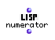

OpenMusic Reference  
---  
[Prev](nth-random)| | [Next](ompower)  
  
* * *

# numerator

  
  
numerator  
  
(lisp module) \-- returns the numerator of the canonical reduced form of
 _rational_ .  

## Syntax

   **numerator**  rational  

## Inputs

name| data type(s)| comments  
---|---|---  
  _rational_ |  a rational|  
  
## Output

output| data type(s)| comments  
---|---|---  
first| an integer|  
  
## Description

Returns the top half of a fraction expressed as _a/b_. The fraction is
automatically converted to the canonical reduced form, that is, both the
numerator and denominator are divided by their highest common divisor, if one
exists. _2/4_ , for example, would be converted to _1/2_ before the
denominator is dropped.  numerator  of an integer returns the integer itself.

* * *

[Prev](nth-random)| [Home](index)| [Next](ompower)  
---|---|---  
nth-random| [Up](funcref.main)| om^

