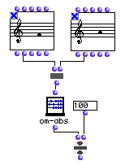

OpenMusic Reference  
---  
[Prev](omand)| | [Next](om-e)  
  
* * *

# om-abs

  
  
om-abs  
  
(arithmetic module) \-- returns the absolute value  

## Syntax

   **om-abs**  self  

## Inputs

name| data type(s)| comments  
---|---|---  
  _self_ |  a number or tree|  
  
## Output

output| data type(s)| comments  
---|---|---  
first| a number or tree| returns the absolute value of  self   
  
## Description

Returns the absolute value of  _self_  power. If  self  is a tree, then a tree
of identical dimensions is returned, containing the absolute value of all the
elements in  _self_ .

|

The absolute value of a number is its distance from zero. Taking the absolute
value of a number is the same as removing the minus sign if the number is
negative. Otherwise, the number is unchanged.  
  
---|---  
  
## Examples

### Determining the number of semitones between two notes

This example calculates the distance in semitones between two notes. The
second inputs (midic) of the second note object is subtracted from the second
input of the first. The result is divided by 100 to get the distance in
semitones. This would be sufficient except when the second note is higher than
the first, as is the case here, in which case the result is negative. Since we
are not concerned only with the interval itself and not with its direction, we
take the absolute value of the result, which will correct it if it is
negative, as it is here, to yield the answer, 4.

* * *

[Prev](omand)| [Home](index)| [Next](om-e)  
---|---|---  
omand| [Up](funcref.main)| om-e

