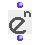

OpenMusic Reference  
---  
[Prev](om-abs)| | [Next](om-log)  
  
* * *

# om-e

  
  
om-e  
  
(arithmetic module) \-- returns e to a given power  

## Syntax

`` **om-e**` self `

## Inputs

name| data type(s)| comments  
---|---|---  
` _self_`|  a number or tree|  
  
## Output

output| data type(s)| comments  
---|---|---  
first| a number or tree| returns e to the `self` power(s)  
  
## Description

Returns _e_ to the `_self_` power. If `_self_` is a tree, then a tree of
identical dimensions is returned, containing _e_ raised to the n for every
element n of the tree.

|

 _e_ is a mathematical constant, like � (pi). It is the natural logarithm, the
unique function which is its own derivative (the derivative of _e x_ is _e
x_.) If you don't know what this is, don't worry about it- you probably won't
need to use it.  
  
---|---  
  
* * *

[Prev](om-abs)| [Home](index)| [Next](om-log)  
---|---|---  
om-abs| [Up](funcref.main)| om-log

