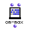

OpenMusic Reference  
---  
[Prev](om-log)| | [Next](om-mean)  
  
* * *

# om-max

  
  
om-max  
  
(arithmetic module) \-- returns the larger of two values  

## Syntax

   **om-max**  self num  

## Inputs

name| data type(s)| comments  
---|---|---  
  _self_ |  a number or tree|  
  _num_ |  a number or tree|  
  
## Output

output| data type(s)| comments  
---|---|---  
first| a number or tree| returns the greater of the two inputs  
  
## Description

This function returns the greater of the two inputs. It compares both numbers
and trees. The arguments need not be of the same type- a list may be compared
with a number or another list. When the arguments are not of the same type,
 om-min  pairs them up in the same manner as [ om-min ](om-min)

* * *

[Prev](om-log)| [Home](index)| [Next](om-mean)  
---|---|---  
om-log| [Up](funcref.main)| om-mean

