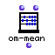
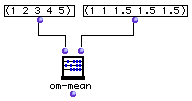

OpenMusic Reference  
---  
[Prev](om-max)| | [Next](om-min)  
  
* * *

# om-mean

  
  
om-mean  
  
(arithmetic module) \-- returns the arithmetic mean of numbers in a list  

## Syntax

`` **om-mean**` self &optional weights `

## Inputs

name| data type(s)| comments  
---|---|---  
` _self_`|  a list|  
` _weights_`|  a list| an optional list of numbers to ponderate the elements
of `_self_`  
  
## Output

output| data type(s)| comments  
---|---|---  
first| a number| returns the arithmetic mean of the numbers in the list  
  
## Description

This function returns the arithmetic mean of the numbers in `_self_` , which
may be of mixed type. This arithmetic mean is obtained by adding all of the
elements in the list together and dividing by the number of elements.

The second input, `_weights_` , is a list of values used to ponderate (to
weight) the values of the first input. If this list is shorter than `_self_`
the extra elements in `_self_` are not weighted. Weighting an element with a
value _n_ causes the mean to be calculated as if that element appeared _n_
times.

## Examples

### Taking a weighted average of a list

Normally, taking the average of (1 2 3 4 5) will return 3, since 1+2+3+4+5 is
15, divided by 5 gives three. This example shows a weighting of the list
towards the higher numbers- 3,4,5 are assigned a weight of 1.5 instead of 1.
The answer in this case is 3.230769230769231.

* * *

[Prev](om-max)| [Home](index)| [Next](om-min)  
---|---|---  
om-max| [Up](funcref.main)| om-min

