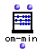
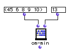
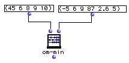

OpenMusic Reference  
---  
[Prev](om-mean)| | [Next](om-random)  
  
* * *

# om-min

  
  
om-min  
  
(arithmetic module) \-- returns the smaller of two values  

## Syntax

`` **om-min**` self num `

## Inputs

name| data type(s)| comments  
---|---|---  
` _self_`|  a number or tree|  
` _num_`|  a number or tree|  
  
## Output

output| data type(s)| comments  
---|---|---  
first| a number; a tree| returns the lesser of the two inputs  
  
## Description

This function returns the lesser of the two inputs. It compares both numbers
and trees. The arguments need not be of the same type- a list may be compared
with a number or another list. When the arguments are not of the same type,
`om-min` pairs them up in the same manner as [`om/`](omdivide)

## Examples

### Comparing a number (an atom) and a list

When the inputs are of different types, each member of the list is compared
with the atom. The result for the example above is (13 6 8 9 10).

### Comparing two lists

When both inputs are lists, the elements are paired off and compared in the
same manner as the `om/`. The result here would be (-5 6 8 9 2.6). Notice that
the second list has been truncated (the 5 at the end has been dropped) since
the elements of the first list have been exhausted.

* * *

[Prev](om-mean)| [Home](index)| [Next](om-random)  
---|---|---  
om-mean| [Up](funcref.main)| om-random

