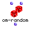

OpenMusic Reference  
---  
[Prev](om-min)| | [Next](om-round)  
  
* * *

# om-random

  
  
om-random  
  
(arithmetic module) \-- generates a psuedo-random number  

## Syntax

`` **om-random**` low high `

## Inputs

name| data type(s)| comments  
---|---|---  
` _low_`|  a number| may be a fraction, an integer, or a float. defaults to 0  
` _high_`|  a number| may be an integer only if `_low_` is an integer.
Otherwise, must be a fraction or a float. defaults to 0  
  
## Output

output| data type(s)| comments  
---|---|---  
first| a float or an integer|  
  
## Description

Generates a pseudo-random number between `_low_` and `_high_` , inclusive. .
The type of random number returned depends on the inputs. Returns a float if
either of the inputs is a float. Returns a fraction if both inputs are
fractions. Returns an integer only if both inputs are integers.

|

We say pseudo-random since a computer can never generate a totally random
number (lacking both imagination and a soul) but the algorithm it uses to
generate the number is sufficiently complex that it might as well be random.  
  
---|---  
  
* * *

[Prev](om-min)| [Home](index)| [Next](om-round)  
---|---|---  
om-min| [Up](funcref.main)| om-round

