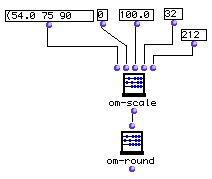

OpenMusic Reference  
---  
[Prev](om-round)| | [Next](om-scalesum)  
  
* * *

# om-scale

  
  
om-scale  
  
(arithmetic module) \-- scales a list based on new maximum and minimum values  

## Syntax

   **om-scale**  self minout maxout &optional minin &optional maxin  

## Inputs

name| data type(s)| comments  
---|---|---  
  _self_ |  a tree| the list to be scaled  
  _minout_ |  a number| the target low number of the rescaled list  
  _maxout_ |  a number| the target high number of the rescaled list  
  _minin_ |  a number| optional; the virtual lower limit of the input list  
 _maxin_ |  a number| optional; the virtual upper limit of the input list  
  
## Output

output| data type(s)| comments  
---|---|---  
first| a tree| returns the tree  _self_  , rescaled  
  
## Description

This function scales the values of elements in a list. The values  _minout_ 
and  _maxout_  specify the target minimum and maximum values for the new list.
For example, the list (1 2 3 4 5) passed to  om-scale  with 1 and 9 as minimum
and maximum values would return 1 3 5 7 9. Note that there is no requirement
that the values be integers.  om-scale  maintains the _relative_ distance
between elements of the list.

The optional inputs  _minin_  and  _maxin_  are used to force  om-scale  to
behave as if  _self_  had upper and lower values other than its lowest and
highest values. This is useful in situations where the input list is a
measurement on a preestablished scale- see the example.

If  _self_  is a nested list, a tree of identical dimensions is returned

Trees can also be rescaled with the [ om-scale/sum ](om-scalesum)
function.

## Examples

### Converting Fahrenheit to Celsius

This example illustrates one way to convert temperatures (or any other scaled
data). The list of Fahrenheit temperatures (54 75 90 102) is passed to the
function. 0 and 100 (the freezing and boiling points of water on the celsuis
scale) are given as target values. The optional inputs are used to specify the
equivalent values on the input (Fahrenheit) scale, since otherwise om-scale
would assume that the lowest and highest values of the input list, i.e. 54 and
102, were equal to the low and high values specified at  _minout_  and
 _maxout_ .  om-round  is used to convert the resulting fractional values into
whole numbers- the list returned is (12 24 32 39)

* * *

[Prev](om-round)| [Home](index)| [Next](om-scalesum)  
---|---|---  
om-round| [Up](funcref.main)| om-scale/sum

