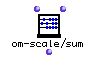

OpenMusic Reference  
---  
[Prev](om-scale)| | [Next](omif)  
  
* * *

# om-scale/sum

  
  
om-scale/sum  
  
(arithmetic module) \-- scales a list based on a new sum  

## Syntax

   **om-scale/sum**  self sum  

## Inputs

name| data type(s)| comments  
---|---|---  
  _self_ |  a tree| the list to be scaled  
  _sum_ |  a number| the target sum of the rescaled list  
  
## Output

output| data type(s)| comments  
---|---|---  
first| a tree| returns the tree  _self_  , rescaled  
  
## Description

This function scales the values of elements in a list. The values of  _self_ 
are recalculated such that they add up to  _sum_  while keeping their
_relative_ sizes intact.

If  _self_  is a nested list, a tree of identical dimensions is returned

Trees can also be rescaled with the [ om-scale ](om-scale) function.

* * *

[Prev](om-scale)| [Home](index)| [Next](omif)  
---|---|---  
om-scale| [Up](funcref.main)| omif

