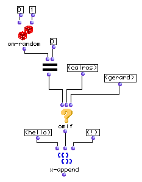

OpenMusic Reference  
---  
[Prev](om-scalesum)| | [Next](omquantify)  
  
* * *

# omif

  
  
omif  
  
(control module) \-- returns  _action_  or  _else_  according to  _test_   

## Syntax

   **omif**  test action &optional else  

## Inputs

name| data type(s)| comments  
---|---|---  
  _test_ |  any| usually a predicate  
  _action_ |  any|  
  _else_ |  any| optional; a value or patch to evaluate instead of  _action_   
  
## Output

output| data type(s)| comments  
---|---|---  
first| any|  
  
## Description

"If _something_ then _do this_ or else _do that_.

 omif  corresponds to the _if-then-else_ construct found in most algebraic
[_programming language_](glossary#PROGRAMMING-LANGUAGE)s. A
[_predicate_](glossary#PREDICATE) is evaluated at the  _test_  input. In
addition to the standard LISP truth value t, any value except nil is
considered to be true. If it is true, then  _action_  is performed. Otherwise,
nil is returned. Using the optional  _else_  argument allows this patch or
function to be evaluated in place of returning nil in the case where  _test_ 
is nil.

## Examples

### Using  omif  to switch between possible outputs

In the example above,  om-random  will generate either a 1 or a zero. If it
returns 1, then the  om=  function will return nil (since 1 does not equal 0)
and  omif  will evaluate  _else_  , the third input, returning (gerard). If
 om-random  returns 0 then  om=  will return t and  omif  will return
 _action_  , its second input, (calros). Whatever the result,  x-append  will
sandwich it between (hello) and (!). The two possible results are therefore:

 ? OM->(hello calros !) 

and

 ? OM->(hello gerard !) 

* * *

[Prev](om-scalesum)| [Home](index)| [Next](omquantify)  
---|---|---  
om-scale/sum| [Up](funcref.main)| omquantify

