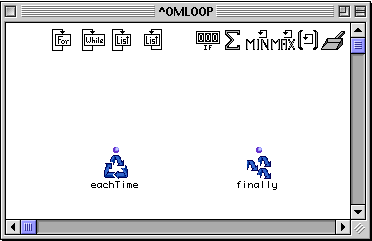

OpenMusic Reference  
---  
[Prev](funcref.omloop)| | [Next](forloop)  
  
* * *

# omloop

  
  
omloop  
  
(control module) \-- a multipurpose function for writing program
[loops](glossary#LOOP)  

## Syntax

`` **omloop**` &rest input `

## Inputs

`omloop` takes as many inputs as needed. They are added with the usual
keystroke combination **option** -->. They will accept any data type, provided
that the functions inside the loop accepts the type.

## Output

Outputs are added to `omloop` as needed from inside the `omloop` window by
adding inputs to the `finaldo` function with the key combination **option**
-->.

## Description

`omloop` is a special form of generic function performing tasks which require
repetitive procedures. These procedures fall broadly into two categories:
iteration and accumulation. Iteration involves stepping through a list of
elements, either elements of a list or a range of values for a
[variable](glossary#VARIABLE), and doing something with the data.
Accumulation is often performed at the same time, meaning that the results of
the calculations are collected in a list, or grouped and processed in some
other way.

Double-clicking the function icon opens a [patch](glossary#PATCH) window:

The functions available in `omloop` are all documented on their own reference
pages in this section of the Users' Manual.

You can see that two special icons have already been placed automatically:
`loopdo (eachTime)` and `finaldo (finally)`. These functions are necessary to
make `omloop` function and cannot be deleted.

Along the top are icons representing the rest of the various kinds of
iterative and accumulative functions available within `omloop`. These
functions are restricted to use within the `omloop` patch box; they cannot be
moved into a normal patch window, though they can be dragged or copied to
other `omloop` boxes. All other standard OM and LISP functions can be used
within the patch window as well.

`omloop` does not have any inputs by default. Inputs are added by clicking the
`omloop` icon and using **option** -->. Inputs will then appear inside the
patch window.

`omloop` has one output by default. Inside the patch window, this output is
represnted by the `finaldo (finally)` function icon. Adding additional inputs
to `finally` adds outputs to the `omloop` icon itself.

`omloop`'s output depends on the choice of iterators, accumulators and output
functions. Multiple iterators and accumulators can be used simultaneously. The
number of possible procedures is thus virtually unlimited.

## The basic idea behind `omloop`

The number of combinations of functions within `omloop` is quite large, making
it impossible to give a single example of its operation that is general enough
to cover all cases. One can, however, explain the basic concept.

In general, a process is repeated as long as certain conditions are met. The
results are then collected and returned. Controlling the conditions for
repetition is done by the **iterator** functions. They are the group of icons
on the upper-left of the `omloop` patch window. Iterators might pass each of
the values of a list individually, or might allow the loop to repeat as long
as a certain [predicate](glossary#PREDICATE) returns t. **All` omloop`
patch windows must have at least one iterator. Otherwise the loop will execute
forever!**

The results are collected by **collector** functions. They are in the upper-
right corner of the patch window. They may simply collect the results of the
repeated calculations into a list, or may count the number of times a certain
result is produced, or add the results of all the calculations together.

The repeated task is accomplished by linking the functions performing the task
to `loopdo (eachTime)` and `finaldo (finally)`. The `eachTime` function (and
therefore, everything connected to it) is evaluated on every repetition save
the last. Connecting it to the collectors triggers them and makes them
function each time the loop executes. The function `finally` (and therefore,
whatever is connected to it) is evaluated on the last repetition of the loop.
It is usually connected to a collector to pass the results of the collection
to the output of `omloop`. Note that additional post-processing functions can
be put between `finally` and the collector to perform some task on the results
of the collection.

The repeated function itself- the task performed on the data- is performed by
everything else in the box.

The following are the special `omloop` functions. See their reference pages
for more details:

 **Iterators**

  * [` forloop`](forloop) \- Steps through a series of numeric values. When a threshold is reached, loop execution stops.

  * [`whileloop`](whileloop) \- Allows repetition (iteration) to continue as long as a predicate returns t.

  * [`listloop`](listloop) \- Causes one repetition for each element of a give n list.

  * [`onlistloop`](onlistloop) \- Causes one repetition for each element of a give n list, but passes [cdr](glossary#CDR)s of the list.

 **Collectors**

  * [` counter (count)`](counter) \- Counts the number of times a given value is non-nil.

  * [`sum`](sum) \- Returns the sum of the collected elements.

  * [`minim (min)`](minim) \- Returns the minimum value of its collected elements.

  * [`maxi (max)`](maxi) \- Returns the maximum value of its collected elements.

  * [`listing (collect)`](listing) \- Collects the result of each repetition into a list.

  * [`accumulator (accum)`](accumulator) \- A generalized customizable accumlator.

 **Outputs**

  * [` loopdo (eachTime)`](loopdo) \- Triggers the repetition.

  * [`finaldo (finally)`](finaldo) \- Returns the result of the loop.

* * *

[Prev](funcref.omloop)| [Home](index)| [Next](forloop)  
---|---|---  
`omloop` and Components Reference| [Up](funcref.omloop)| forloop

