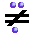

OpenMusic Reference  
---  
[Prev](omequal)| | [Next](omlessthan)  
  
* * *

# om/=

  
  
om/=  
  
(predicates module) \-- returns t if `_self_` and `_num_` are not equal.  

## Syntax

`` **om/=**` self num `

## Inputs

name| data type(s)| comments  
---|---|---  
` _self_`|  a number|  
` _num_`|  a number|  
  
## Output

output| data type(s)| comments  
---|---|---  
first| t or nil|  
  
## Description

This [_predicate_](glossary#PREDICATE) function returns t if and only if
the two inputs do not have the same value.

Usually used in conjunction with [`omif`](omif)

* * *

[Prev](omequal)| [Home](index)| [Next](omlessthan)  
---|---|---  
om=| [Up](funcref.main)| om<

