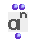

OpenMusic Reference  
---  
[Prev](numerator)| | [Next](ommultiply)  
  
* * *

# om^

  
  
om^  
  
(arithmetic module) \-- raises a number to a given power  

## Syntax

   **om^**  self num  

## Inputs

name| data type(s)| comments  
---|---|---  
  _self_ |  a number or tree|  
  _num_ |  a number or tree|  
  
## Output

output| data type(s)| comments  
---|---|---  
first| a number; a tree| returns the first input's number(s) raised to the power(s) of the second  
  
## Description

Raises  _self_  to the power  _num_ . The arguments need not be of the same
type- a list may be raised to a single power or elements of a list may be
raised to the powers indicated by the elements of another list. When the
arguments are not of the same type,  om^  pairs them up in the same manner as
[ om/ ](omdivide)

|

The name of the  om^  function uses the carat (^) to represent raising a
number to a power, as is traditional in programming languages.  
  
---|---  
  
* * *

[Prev](numerator)| [Home](index)| [Next](ommultiply)  
---|---|---  
numerator| [Up](funcref.main)| om*

