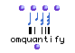
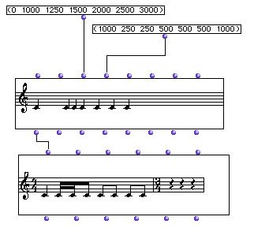
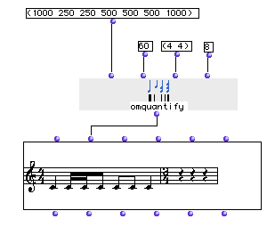

OpenMusic Reference  
---  
[Prev](omif)| | [Next](orbites)  
  
* * *

# omquantify

  
  
omquantify  
  
(score module) \-- performs a rhythmic transcription, converting a list of
durations into a rhythm tree  

## Syntax

   **omquantify**  durs tempi measures max/ &optional forbid offset precis  

## Inputs

name| data type(s)| comments  
---|---|---  
  _durs_ |  a list of numbers| the durations to convert  
  _tempi_ |  a number or list thereof| the tempo or tempi to use for the
transcription  
  _measures_ |  a list of lists| a list of time signatures to use in the
format (a b)  
  _max/_ |  an integer or tree thereof| the maximum permitted subdivision(s)
of the beat  
  _forbid_ |  a list or tree of integers| optional; defaults to nil. A list of
subdivisions which are not allowed in the transcription  
  _offset_ |  an integer | optional; defaults to 0. The offset will move the
entire transcription to the right by the number of beats specified here  
 _precis_ |  a float between 0 and 1.0| optional; specifies a level of
precision in the transcription. Defaults to 0.5  
  
## Output

output| data type(s)| comments  
---|---|---  
first| a rhythm tree|  
  
## Description

 omquantify  converts a list of durations, given in milliseconds into a rhythm
tree.

The inputs  _tempi_  ,  _measures_  ,  _max/_  , and  _forbid_  take either a
single value, which is then applied globally, or a list of values, in which
case they affect the transcription on the local level, as described below.

The  _tempi_  input specifies a tempo for the transcription. If a list is
given, the different tempi are used for each consecutive measure of
transcription.

The  _measures_  input takes either a single time signature, which is used for
the entire transcription, or a list in the form (a b) or a list, i.e. ((4 4)
(6 8)).

|  **A minor bug**  
---|---  
 |

The last measure of the transcription may have a time signature with one fewer
beats than the indicated time signature; this has not affected the
transcription. We are working on this and it should be fixed soon.  
  
  _max/_  allows you to set the maximum number of subdivisions in a beat,
which is always the second number of the time signature, even in ternary
meters. Setting it to 4 in a (4 4) time signature will set 16th as the
smallest permitted note value. Setting it to 4 in (6 8) will set 32nds as the
smallest. If  _max/_  is an integer, it will be applied globally. Otherwise,
 _max/_  may be a tree, a list of lists of integers in which each list
contains the maximum allowed subdivisions for _each beat_ of the measure, for
example ((4 3)) in a (2 8) time signature will allow up to 4 subdivisions of
the first eighth note and up to 3 subdivisions of the second. You are not
obliged to specify a sublist for each measure- leaving ((4 3)) in the above
example will apply those subdivision limits to each measure.

  _forbid_  allows you to either prevent or force subdivisions of the beat.
Like  _max/_  , you may use a tree to specify local settings. If you use a
simple list of integers, these subdivsions will be forbidden globally in the
transcription. Make sure these values don't conflict with the settings of
 _max/_  or you may lose notes in the transcription. You can use a list of
lists to specify subdivisions to forbid on a measure-by-measure basis rather
than globally: ((3) (5 6)) will forbid triplets in the first measure and
quint- and sextuplets in the second. Using the empty set () for a measure
indicates that all subdivisions are permitted up to the maximum set at
 _max/_ . You may add another level of [nesting](glossary#NESTING) to
specify the subdivisions to forbid on a beat-by-beat basis: (((3 5) 3) (5 6))
is like the last example, except that _within_ the first measure, the first
beat will have no triplets or quintuplets, while the second beat will have no
quintuplets, while triplets are permitted. The length of these sublists will
obviously depend on the measure lengths you have set. Note also that the OM
considers the 'beat' to be whatever is in the denominator of the time
signature, even in ternary meters.

  _forbid_  also allows you to force, rather than suppress, certain
subdivisions either on the global, measure, or beat level. To do this, add a !
at the beginning of any sublist. ((! 3 4) (5)) Will force subdivisions of 3 or
4 in the first measure while forbidding quintuplets in the second.

Let's look at the following example using all the possibilities:

    
    
    (((5 4) () (! 3 6) ()) (() () (8 7) ()) (3 2) ())  
  
---  
  
indicates that:

  * first measure

    * first beat - subdivisions of 5 and 4 forbidden

    * second beat - no restrictions

    * third beat - only subdivisions by 3 and 6 permitted

    * fourth beat - no restrictions

  * second measure

    * first beat - no restrictions

    * second beat - no restrictions

    * third beat - subdivisions by 8 and 7 forbidden

    * fourth beat - no restrictions

  * third measure

    * all beats - subdivisions by 3 and 2 forbidden

  * fourth measure

    * all beats - no restrictions

If your settings do not allow enough precision or subdivisions of the beat,
they may cause OM to drop some notes, in which case, a warning like this will
appear in the listener:

 ? Warning: with the given constraints, 2 notes are lost while quantizing  

 _offset_  is a number of beats (the denominator of the first measure) to
skip; the entire sequence is moved to the right by the number of beats
specified here.

  _precis_  is a decimal value between 0 and 1.0 which controls the precision
of the transcription. Lower values produce simpler transcriptions. Higher
values produce more accurate transcriptions.

When you connect a **Chord-seq** directly to a **Voice** :

 omquantify  is called automatically to convert the durations of the **Chord-
seq** into a rhythm tree for the **Voice**. In fact, **Voice** uses
 omquantify  as a [_method_](glossary#METHOD). You can adjust the
parameters for this automatic  omquantify  in the preferences, under "Quantify
Preferences." Note that the  omquantify  module will still have its own
defaults and behave accordingly- the preferences are only for the **Voice**
object. See the section on [Preferences](concepts.preferences).

## A simple  omquantify  example

###

This example works well with very little help from  omquantify  since the
durations divide evenly into the tempo specified. Try changing the tempo and
the maximum number of subdivisions. Then add the optional  _precis_  input and
set the precision to 0, then to 1.0 to see the difference.

* * *

[Prev](omif)| [Home](index)| [Next](orbites)  
---|---|---  
omif| [Up](funcref.main)| orbites

