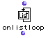
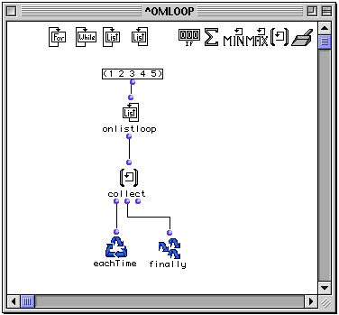

OpenMusic Reference  
---  
[Prev](listloop)| | [Next](counter)  
  
* * *

# onlistloop

  
  
onlistloop  
  
(control module) \-- Enumerates consecutive groups of the elements of a list
within `omloop`  

## Syntax

`` **onlistloop**` list &optional by `

## Inputs

name| data type(s)| comments  
---|---|---  
` _list_`|  a list or tree|  
` _by_`|  a function name or lambda function|  
  
## Output

output| data type(s)| comments  
---|---|---  
first| any| returns the [cdr](glossary#CDR) of `_list_` , then the cddr,
then the cdddr, etc.  
  
## Description

|

`onlistloop` is part of a group of functions for performing iterative
[loops](glossary#LOOP). They can only be used within an
[omloop](omloop) patch window. Since they only function within the
context of the entire repeating loop, they (or any function connected to them)
cannot be evaluated directly within the patch window. You must evaluate the
entire loop. See the entry on `omloop` for more information.  
  
---|---  
  
`onlistloop` functions almost exactly like [`listloop`](listloop).
Instead of individual elements of the list, however, `onlistloop` performs
[cdr](glossary#CDR) on `_list_` , then [cddr](glossary#CDDR), and so
on, [_recursively_](glossary#RECURSIVITY). Thus, it first returns the
whole list, then the list minus its first element, then the list minus the
first two elements, etc., until the list is exhausted.

## Examples

### A simple `onlistloop` example

This demonstrates how `onlistloop` steps through progressively smaller
[_cdr_](glossary#CDR)s of `_list_`

` onlistloop` passes a progressively smaller chunk of `_list_` each time, and
the sublists are collected into a list by `collect`:

`? OM->((1 2 3 4 5) (2 3 4 5) (3 4 5) (4 5) (5))`

* * *

[Prev](listloop)| [Home](index)| [Next](counter)  
---|---|---  
listloop| [Up](funcref.omloop)| counter (count)

