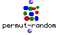

OpenMusic Reference  
---  
[Prev](patterns)| | [Next](permutations)  
  
* * *

# permut-random

  
  
permut-random  
  
(combinatorial module) \-- returns the list with a random order of elements  

## Syntax

`` **permut-random**` list `

## Inputs

name| data type(s)| comments  
---|---|---  
` _list_`|  a list or tree|  
  
## Output

output| data type(s)| comments  
---|---|---  
first| any type| the list ordered randomly  
  
## Description

Returns the list with the order scrambled. The resulting list will have the
same number of elements but the order will be random. each time the function
is run. `permut-random` respects [nesting](glossary#NESTING), i.e. if the
list is a tree, only first-level elements of the tree are scrambled- sublists
are not touched. For example, if the list (1 (2 3) 4) is given, (2 3) will
remain in the same order though their place in the master list may change,
i.e. ((2 3) 1 4).

* * *

[Prev](patterns)| [Home](index)| [Next](permutations)  
---|---|---  
patterns| [Up](funcref.main)| permutations

