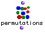

OpenMusic Reference  
---  
[Prev](permut-random)| | [Next](pgmout)  
  
* * *

# permutations

  
  
permutations  
  
(combinatorial module) \-- returns a exhaustive list of all the permutations
of a list  

## Syntax

   **permutations**  bag  

## Inputs

name| data type(s)| comments  
---|---|---  
  _bag_ |  a list or tree| the 'bag' of elements to draw from  
  
## Output

output| data type(s)| comments  
---|---|---  
first| a tree| since the input is a list, the output is necessarily a list of
lists, a tree  
  
## Description

Returns a list containing all the possible permutations of the master list,
 _bag_ . For example, if the list is (1 2) then there are two possible
permutations of those elements: (1 2) and (2 1). If the list is (1 2 3) then
there are six possibilities: (1 2 3), (1 3 2), (2 1 3), (2 3 1), (3 1 2), and
(3 2 1).  permutations  respects [nesting](glossary#NESTING), i.e. only
first-level elements of the tree are permuted- sublists are not touched.

Note also that for  permutations , the list (1 1 1) _still_ has 6
permutations, all of which are (1 1 1).

|

 permutations  is a [recursive](glossary#RECURSIVITY) function.
Processing large lists with it may therefore result in an out of memory error.  
  
---|---  
  
* * *

[Prev](permut-random)| [Home](index)| [Next](pgmout)  
---|---|---  
permut-random| [Up](funcref.main)| pgmout

