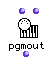

OpenMusic Reference  
---  
[Prev](permutations)| | [Next](pitchbend)  
  
* * *

# pgmout

  
  
pgmout  
  
(midi module) \-- sends a MIDI program (patch) change message  

## Syntax

   **pgmout**  prog chans &optional port  

## Inputs

name| data type(s)| comments  
---|---|---  
  _values_ |  an integer| defaults to 2  
  _chans_ |  an integer or list thereof| defaults to 1  
  _port_ |  an integer or list thereof| The MIDI port to send on  
  
## Output

output| data type(s)| comments  
---|---|---  
first| nil| This output will always return nil; the program change message is sent out anyway.  
  
## Description

 pgmout  sends a program change of value  _prog_  on the channel (or channels,
if  _chans_  is a list) specified. The optional input  _port_  allows you to
specify which MIDI port the message(s) will go out on.

|  **OM and MIDI**  
---|---  
 |

OM can be configured to communicate with any [_MIDI_](glossary#MIDI)
device. See the chapter on [configuring Midishare](getting-started.install-
midishare) for more information.  
  
* * *

[Prev](permutations)| [Home](index)| [Next](pitchbend)  
---|---|---  
permutations| [Up](funcref.main)| pitchbend

