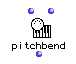

OpenMusic Reference  
---  
[Prev](pgmout)| | [Next](pitchwheel)  
  
* * *

# pitchbend

  
  
pitchbend  
  
(midi module) \-- sends a MIDI pitch wheel controller message  

## Syntax

`` **pitchbend**` values chans &optional port `

## Inputs

name| data type(s)| comments  
---|---|---  
` _values_`|  an integer or list thereof| defaults to 0  
` _chans_`|  an integer or list thereof| defaults to 1  
` _port_`|  an integer or list thereof| The MIDI port to send on  
  
## Output

output| data type(s)| comments  
---|---|---  
first| nil| This output will always return nil; the pitch bend message is sent
out anyway.  
  
## Description

Like [`pitchwheel`](pitchwheel), `pitchbend` sends a MIDI message number
224 out on the channel or channels specified. The difference is that
`pitchbend` takes a value between 0 and 127, which is sent out twice as the
first and second data bytes of the message, while the more precise
`pitchwheel` function takes a value between -8192 and 8190 (which takes up
both data bytes).

The optional input `_port_` allows you to specify which MIDI port the
message(s) will go out on.

|  **OM and MIDI**  
---|---  
 |

OM can be configured to communicate with any [_MIDI_](glossary#MIDI)
device. See the chapter on [configuring Midishare](getting-started.install-
midishare) for more information.  
  
* * *

[Prev](pgmout)| [Home](index)| [Next](pitchwheel)  
---|---|---  
pgmout| [Up](funcref.main)| pitchwheeel

