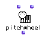

OpenMusic Reference  
---  
[Prev](pitchbend)| | [Next](play)  
  
* * *

# pitchwheeel

  
  
pitchwheeel  
  
(midi module) \-- sends a MIDI pitch wheel controller message  

## Syntax

`` **pitchwheel**` values chans &optional port `

## Inputs

name| data type(s)| comments  
---|---|---  
` _values_`|  an integer or list thereof| defaults to 0  
` _chans_`|  an integer or list thereof| defaults to 1  
` _port_`|  an integer or list thereof| The MIDI port to send on  
  
## Output

output| data type(s)| comments  
---|---|---  
first| nil| This output will always return nil; the pitch wheel message is
sent out anyway.  
  
## Description

`pitchwheel` sends a MIDI pitch wheel message (number 224) with value (or
values, if `_values_` is a list) between -8192 and 8190 out on the channel (or
channels, if `_chans_` is a list) specified. The optional input `_port_`
allows you to specify which MIDI port the message(s) will go out on.

|  **OM and MIDI**  
---|---  
 |

OM can be configured to communicate with any [_MIDI_](glossary#MIDI)
device. See the chapter on [configuring Midishare](getting-started.install-
midishare) for more information.  
  
* * *

[Prev](pitchbend)| [Home](index)| [Next](play)  
---|---|---  
pitchbend| [Up](funcref.main)| play

