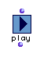

OpenMusic Reference  
---  
[Prev](pitchwheel)| | [Next](polykeypres)  
  
* * *

# play

  
  
play  
  
(maquette module) \-- causes playback of OM music objects  

## Syntax

   **play**  self &optional &key :approx :interval :port  

## Inputs

name| data type(s)| comments  
---|---|---  
  _self_ |  any playable OM score class object|  
  _:approx_ |  a positive integer| a keyword input; the number of divisions (tones) in the octave for midicent approximation  
 _:interval_ |  a list containing two positive integers| the start and stop times, in milliseconds elapsed  
  _:port_ |  a positive integer| the MIDI port to play out over  
  
## Output

output| data type(s)| comments  
---|---|---  
first| causes playback| You'll see a wacky eight-digit number in the listener. Don't be afraid.  
  
## Description

Used without optional inputs,  play  does exactly that, playing back any OM
music class object. It is like going into the editor for that object and
clicking the Play button.

The optional keyword inputs allow you to further control playback. See the
[introduction to the Function Reference](funcref.intro) for an
explanation of how keyword inputs operate.

The  _:approx_  input allows you to specify the temperament of the octave in
exactly the same way as for the [ approx-m ](approx-m). See its entry for
details. You may use whole tone, 12-tone, 24-tone or 48-tone divisions of the
octave.

The  _:interval_  input lets you specify where to begin and end playback. It
is a list of two values in milliseconds in the form _(start end)_ where zero
is the beginning of the object.

The  _:port_  input lets you specify a MIDI port for playback. It must be an
integer.

* * *

[Prev](pitchwheel)| [Home](index)| [Next](polykeypres)  
---|---|---  
pitchwheeel| [Up](funcref.main)| polykeypres

