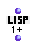

OpenMusic Reference  
---  
[Prev](funcref.main)| | [Next](minus1)  
  
* * *

# 1+

  
  
1+  
  
(lisp module) \-- adds 1 to a number  

## Syntax

`` **1+**` number `

## Inputs

name| data type(s)| comments  
---|---|---  
` _number_`|  a number|  
  
## Output

output| data type(s)| comments  
---|---|---  
first| a number|  
  
## Description

Adds one to `_number_` and returns the result. A useful shortcut.

* * *

[Prev](funcref.main)| [Home](index)| [Next](minus1)  
---|---|---  
OM Function Reference| [Up](funcref.main)| 1-

