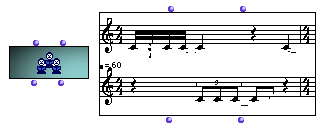

OpenMusic Reference  
---  
[Prev](note)| | [Next](sound)  
  
* * *

# Poly

  
  
Poly  
  
(score module) \--  

## Syntax

`` **Poly**` self voices `

## Slots

name| data type(s)| comments  
---|---|---  
` _self_`| [ **Poly**](poly) object|  
` _chord-seqs_`|  list of [**Voice**](voice) objects|  
  
## Notes

[ **Poly**](poly) has a graphic editor described in detail in the
[Editors Reference](editors.notation)

* * *

[Prev](note)| [Home](index)| [Next](sound)  
---|---|---  
Note| [Up](classref.main)| Sound

