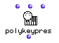

OpenMusic Reference  
---  
[Prev](play)| | [Next](posn-match)  
  
* * *

# polykeypres

  
  
polykeypres  
  
(midi module) \-- sends a MIDI key pressure message  

## Syntax

`` **polykeypres**` values pitch chans `

## Inputs

name| data type(s)| comments  
---|---|---  
` _values_`|  an integer or list thereof | defaults to 100  
` _pitch_`|  an integer or list thereof| defaults to 6000  
` _chans_`|  an integer| defaults to 1  
  
## Output

output| data type(s)| comments  
---|---|---  
first| nil| This output will always return nil; the key pressure message is
sent out anyway.  
  
## Description

`polykeypres` sends a key pressure message (number 160 in the MIDI standard)
of `_values_` and `_pitch_` , both of which may be a single value or a list of
values, on the channel specified. The key pressure message or messages are
specific to single keys currently depressed; compare with the channel pressure
message of the [`aftertouch`](aftertouch) function, which is used to send
the highest pressure value on a given channel.

|  **OM and MIDI**  
---|---  
 |

OM can be configured to communicate with any [_MIDI_](glossary#MIDI)
device. See the chapter on [configuring Midishare](getting-started.install-
midishare) for more information.  
  
* * *

[Prev](play)| [Home](index)| [Next](posn-match)  
---|---|---  
play| [Up](funcref.main)| posn-match

