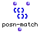

OpenMusic Reference  
---  
[Prev](polykeypres)| | [Next](posn-order)  
  
* * *

# posn-match

  
  
posn-match  
  
(lists module) \-- Constructs a new list from a list of elements and a list of
ordinal references  

## Syntax

   **posn-match**  list positions  

## Inputs

name| data type(s)| comments  
---|---|---  
  _list_ |  a tree| the list of elements to use as material  
  _positions_ |  a list of non-negative integers| The ordinal references for
constructing the new list  
  
## Output

output| data type(s)| comments  
---|---|---  
first| a tree| a list composed of elements from  _list_  at the specified
 _positions_   
  
## Description

 posn-match  constructs a new list by treating the list  _positions_  as a
list of ordinal references and replacing them with the correspondint elements
in  _list_ . The [nesting](glossary#NESTING) of  _positions_  is
maintained even though the elements are replaced. If the elements which
replace them are themselves lists, additional nesting will be produced.

To reference the ordinal positions,  posn-match  supports the same syntax
understood by the [ expand-lst ](expand-lst) function.

Elements in  _positions_  which refer to non-existant positions in  _list_ 
will be replaced by nil.

## Examples

### Constructing a list using literal ordinal references

 posn-match  will take ((0 1) 4 (6)) and replace those numbers with the
ordinals they reference in the first list, **keeping the nesting as is** :

 ? OM->((10 20) 50 (70)) 

### Constructing a list using ordinal references with the  expand-lst  syntax

Here is an example of using the  expand-lst  syntax to construct a list. The
same first input list is used, but instead of literal ordinal references,
 _positions_  uses the special syntax explained in the  expand-lst  entry.

The 3*(0) means that the element at position 0 will be repeated three times.
Following that, the 3_6 means that the elements between positions 3 and 6 will
be enumerated. The whole thing generates:

 ? OM->(10 10 10 40 50 60 70) 

* * *

[Prev](polykeypres)| [Home](index)| [Next](posn-order)  
---|---|---  
polykeypres| [Up](funcref.main)| posn-order

