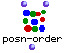
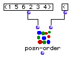

OpenMusic Reference  
---  
[Prev](posn-match)| | [Next](prime)  
  
* * *

# posn-order

  
  
posn-order  
  
(combinatorial module) \-- returns an index of ordinals positions for a given
sort function performed on a list  

## Syntax

`` **posn-order**` list test `

## Inputs

name| data type(s)| comments  
---|---|---  
` _list_`|  a list or tree|  
` _test_`|  a symbol or function name or lambda function|  
  
## Output

output| data type(s)| comments  
---|---|---  
first| a list of integers| the ordinal positions of the elements in the sorted
list (the first is considered the 0th element.  
  
## Description

Generates an index or ordinal positions for a given sort function. The
function or symbol at `_test_` is used to sort the list, as in the [`sort.`
function](sort.). However, instead of returning the sorted list, `posn-
order` returns an index of the operation- a list of numbers indicating the
ordinal positions that the elements would have in the new list after the
sorting is performed.

## Examples

|

Don't forget that for all lisp functions, what we call the first element in a
list is considered to be at position 0, i.e. to be the 0th element. What we
call the second element of the list is in position 1, i.e. the "first" element
of the list, and so on.  
  
---|---  
  
### Using posn-order

The list (1 5 6 2 3 4) is passed to `posn-order`. The result of the sort would
normally be (1 2 3 4 5 6).

This means that the element in position 0, 1, would stay in place, occupying
the 0th place in the sorted list. The next element of the original, 5, would
occupy position 4 in the sorted list. The next element of the original, 6,
would occupy position 5 of the sorted list, and so on. These are the value
returned by the function:

`? OM->(0 4 5 1 2 3)`

* * *

[Prev](posn-match)| [Home](index)| [Next](prime)  
---|---|---  
posn-match| [Up](funcref.main)| prime?

