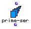
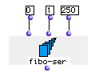

OpenMusic Reference  
---  
[Prev](prime)| | [Next](range-filter)  
  
* * *

# prime-ser

  
  
prime-ser  
  
(series module) \-- generates a list of prime numbers  

## Syntax

`` **prime-ser**` max &optional numelem `

## Inputs

name| data type(s)| comments  
---|---|---  
` _max_`|  a non-negative number| The upper limit of the series. Defaults to
100  
` _numelem_`|  a number| optional; the maximum number of elements to return
(unless) `_max_` is reached. Defaults to 10  
  
## Output

output| data type(s)| comments  
---|---|---  
first| a list of primes|  
  
## Description

Returns a list of prime numbers, ranging from 0 up to `_max_`.

The optional parameter `_numelem_` limits the maximum number of elements.

## Examples

### Calculating the first twenty-one prime numbers

Here we see `prime-ser` set to produce all the primes before 100 (of which
there are 26). The optional input `_numelem_` is set to 20, which will limit
the list to 21 terms. It returns

`? OM->(1 2 3 5 7 11 13 17 19 23 29 31 37 41 43 47 53 59 61 67 71)`

* * *

[Prev](prime)| [Home](index)| [Next](range-filter)  
---|---|---  
prime?| [Up](funcref.main)| range-filter

